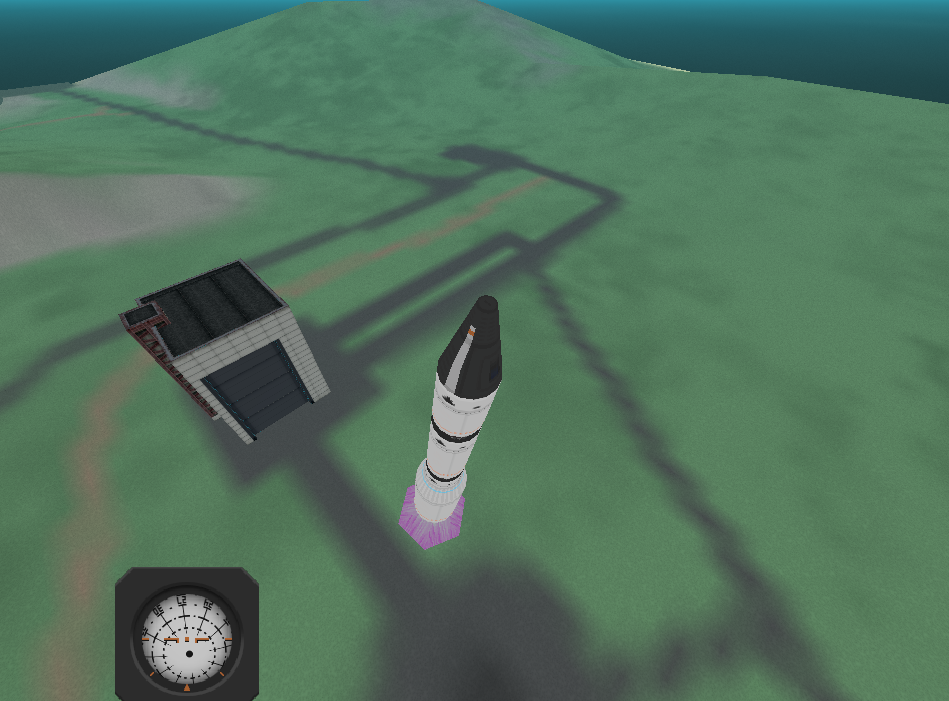
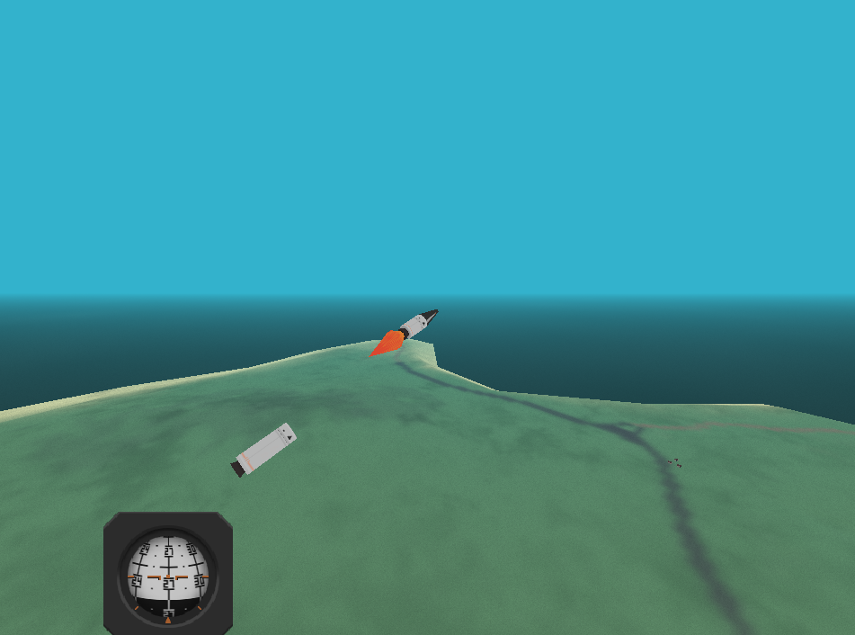
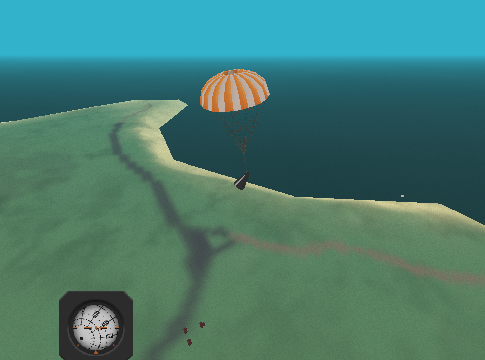
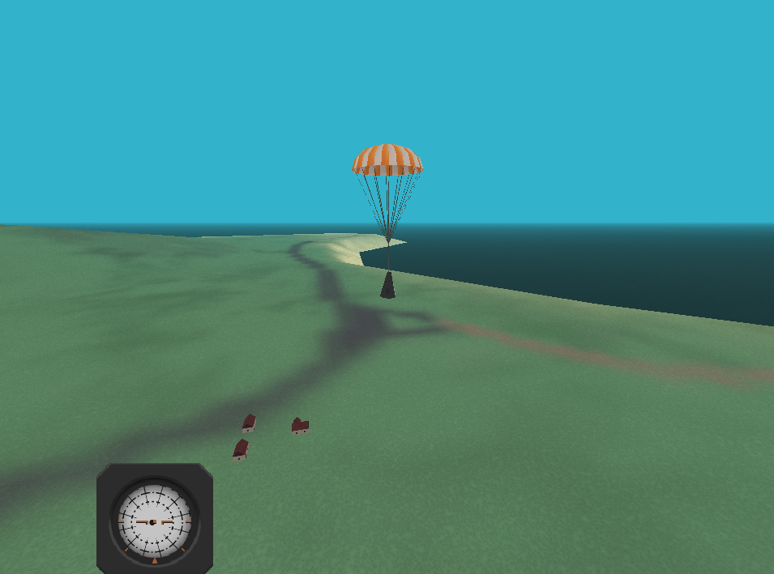

# rkt

## 1. Quickstart

Use `go run .` from the project root.

Move the mouse to rotate the camera around the craft.

| keys    | action                                                      |
|---------|-------------------------------------------------------------|
|  W, S   | pitch down/up                                               |
|  A, D   | yaw left/right                                              |
|  Q, E   | roll left/right                                             |
|  Space  | activate the next stage (depends on vehicle configuration)  |
|  -, =   | zoom camera out/in                                          |
|  Esc    | quit                                                        |

## 2. Building

Standard Go rules persist - please note that this project uses CGO and therefore make sure you have the right version of the GCC compiler installed on your machine (please refer to https://go.dev/doc/install/gccgo). On Windows Winlibs Mingw64 toolchain is confirmed to work properly.

## 3. Resources

The resources are stored in a single .ZIP folder, not unlike the .PK3 format. Resources other than bitmaps (and possibly sound files in the future) follow the convention of `<name>.<type>.<ext>` - allowing the game to discern between different resource types and thus to use an correct loader.

## 4. Progress

A short and hopefully up-to-date list of things to implement:

#### OK

- Staging
- Fix camera projection matrices
- Haze implemented as OpenGL fog
- Parachutes
- Impulse can create angular momentum

#### WIP

- Calculate Centre of Mass
- Part drag calculation based on AoA (Angle of Attack)
- Mouse-based vehicle editor

#### TODO

- Angular movement around the CoM
- Altitude-dependent skybox
- Proper terrain collisions
- Inertia calculated based on the simple geom. shape description
- Lift
- Basic lift control devices (all moving fins)
- Ailerons, rudders, elevators
- Airbrakes and spoilers
- Cockpit view

#### IDEA

- Key-based (with some mouse usage) vehicle editor

