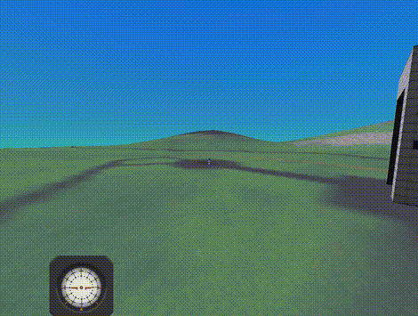
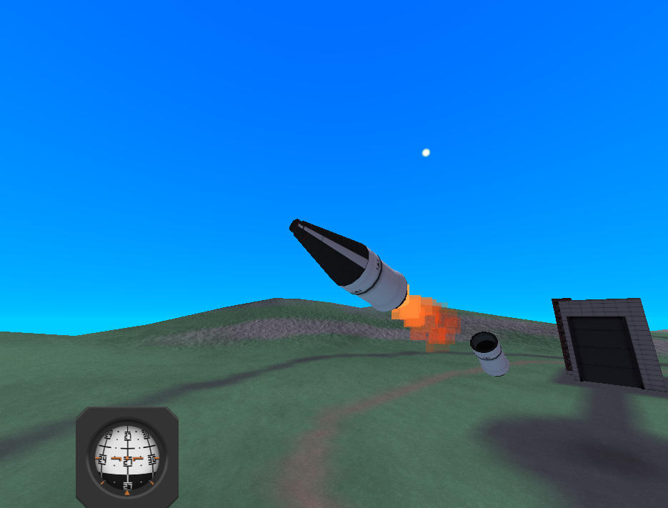
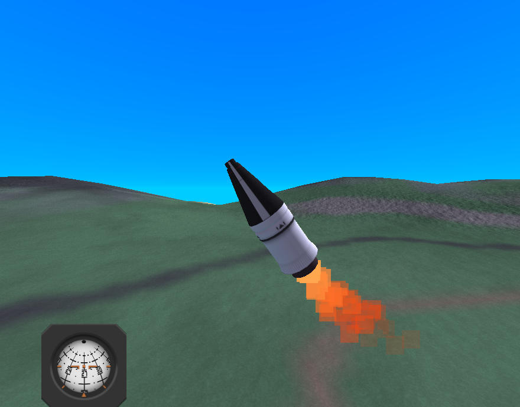
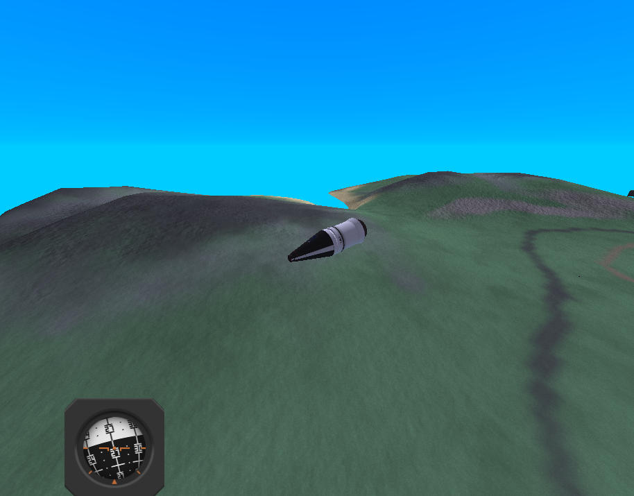
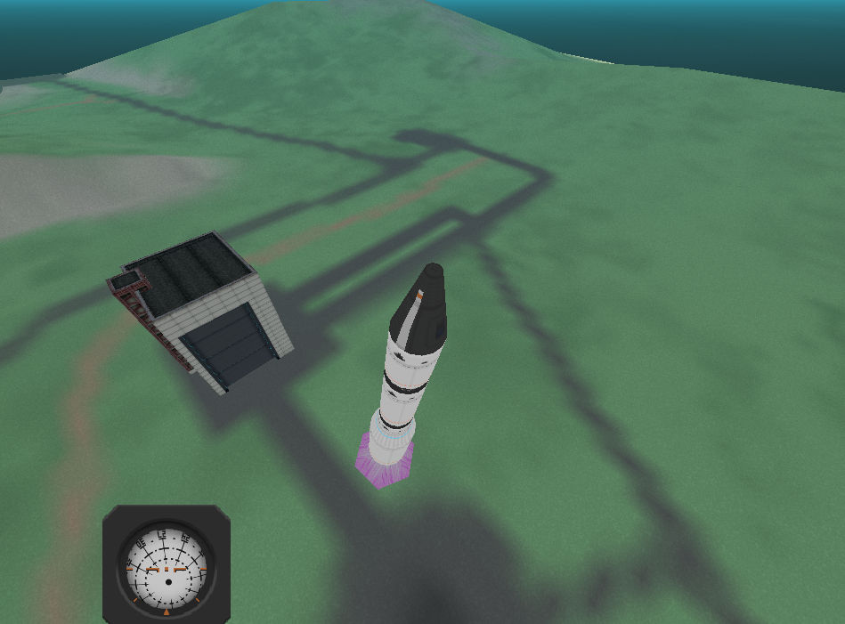
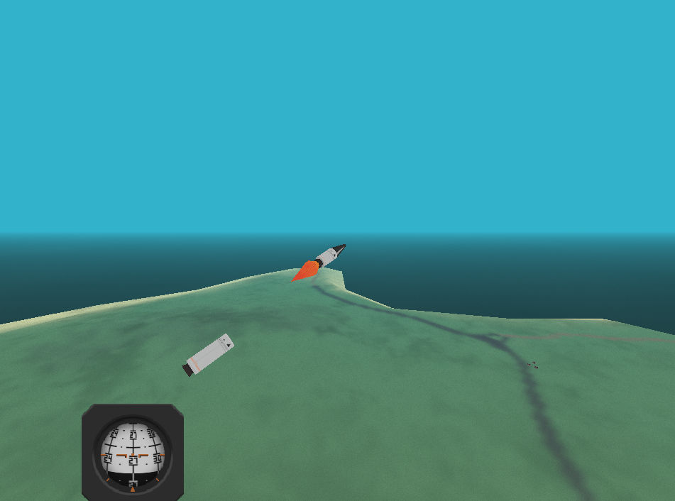
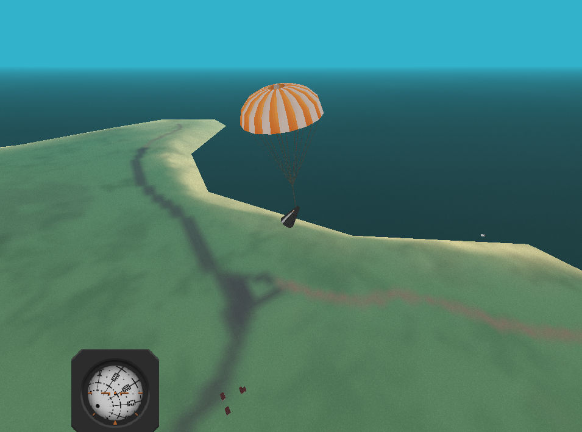
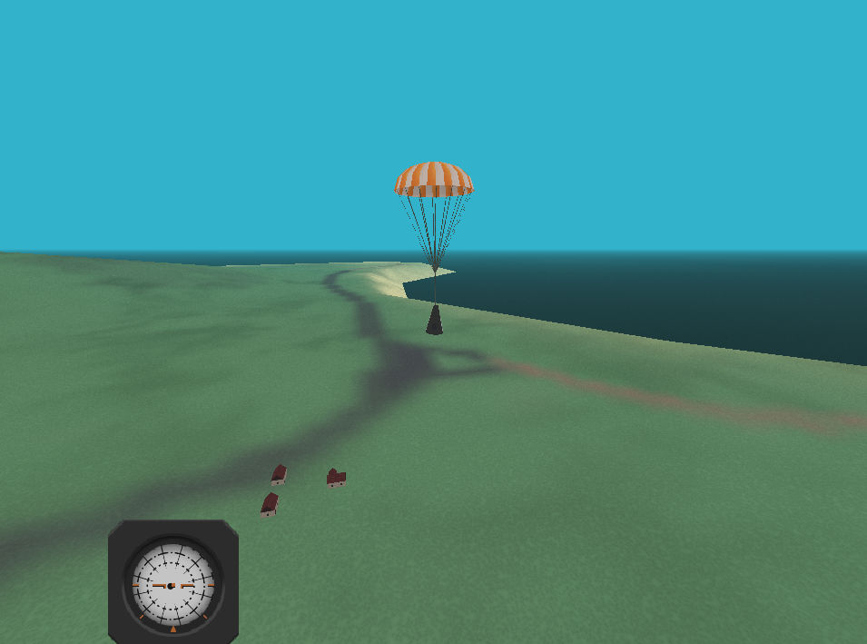

# rkt

## 1. Quickstart

Move the mouse to rotate the camera around the craft.

| Keybind | Action                                                     |
| ------- | ---------------------------------------------------------- |
| `W`/`S` | pitch down/up                                              |
| `A`/`D` | yaw left/right                                             |
| `Q`/`E` | roll left/right                                            |
| `Space` | activate the next stage (depends on vehicle configuration) |
| `-`/`=` | zoom camera out/in                                         |
| `,`/`.` | speed the time down/up (1/4x, 1/2x, 1x, 2x, 4x, 8x)        |
| `Esc`   | quit                                                       |

## 2. Building

See [doc/BUILDING.md](doc/BUILDING.md).

## 3. Resources

The resources are stored in a single `.zip` archive. On startup the game decompresses the archive and traverses the whole file tree, attempting to load each file. There are three rules to adding resources:

- the directories' names should not contain the dot character,
- the resource files' names should always contain a file extension,
- the file's suffix (the part of the filename after the first dot) will be used for selecting the appropiate resource loader.

Each resource is identified in-game by the access path inside the archive eg. `base/geom/home` (notice the lack of file extension) for the `base/geom/home.bml`. The identificators won't collide, since the loaded resource data is placed in two different collections. For the list of the available loaders see the bottom part of the [src/load.go](src/load.go).

## 4. Gallery

## 5. Progress

A short and hopefully up-to-date list of things to implement:

#### OK

- Staging
- Fix camera projection matrices
- Haze implemented as OpenGL fog
- Parachutes
- Impulse can create angular momentum
- Calculate Centre of Mass
- Angular movement around the CoM
- Inertia calculated based on the simple geom. shape description
- Migrate to OpenGL3
- Altitude-dependent skybox

#### WIP

- Part drag calculation based on AoA (Angle of Attack)
- Mouse-based vehicle editor

#### TODO

- Proper terrain collisions
- Try out orbital mechanics
- Fuel flow and distribution
- Lift
- Basic lift control devices (all moving fins)
- Ailerons, rudders, elevators
- Airbrakes and spoilers
- Cockpit view

#### IDEA

- Key-based (with some mouse usage) vehicle editor
- Electrical circuits: actuators, generators, batteries
- Hydraulic circuits: servos, actuators, accumulators, pumps

## 6. Legacy

### rktv7

Version before the migration from OpenGL 2.1 to OpenGL 3.3.

